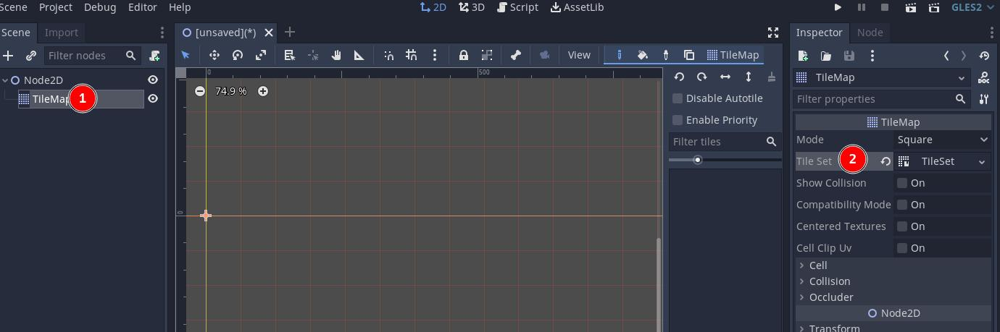
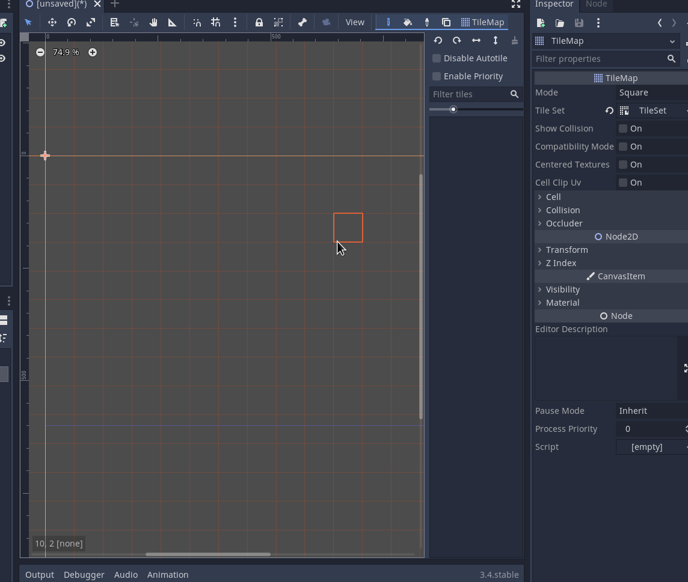
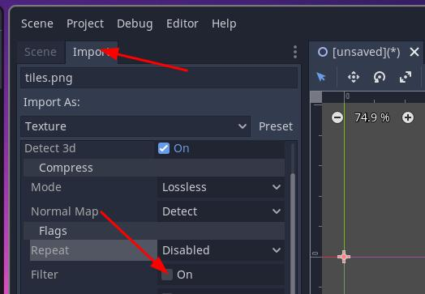
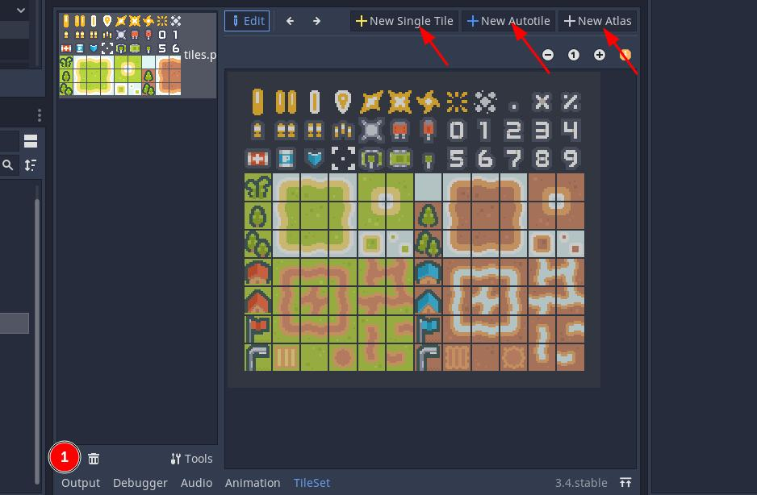
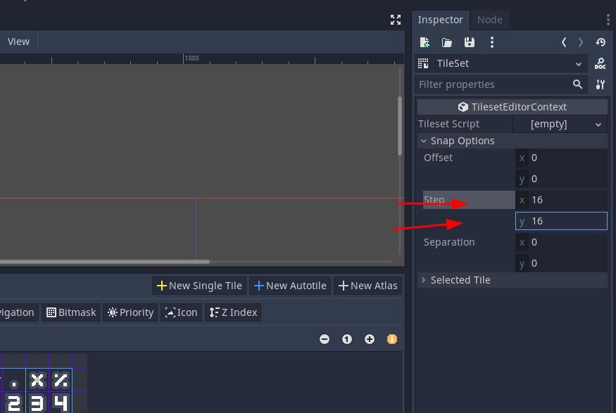
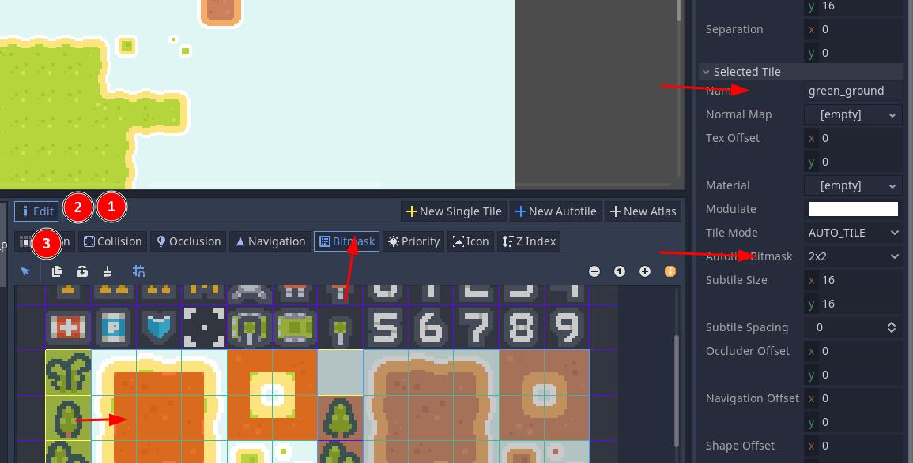

# Tileset editor usage
Here we will see how to use the tile map editor in **Godot 1.3**.

First thing, you must create a 2D scene, and then add a **TileMap** node to it. Then you can select it and add a Tile Set to it as follows:

Then, clicking two times on the TileSet (2 in the image above), you can get the **Tile set editor**. You can click **shift + f12** to make the editor window reach the entire screen. Something like:

Then, within this menu, you can load your **TileMap**, remember to turn off the option **Filter** in the import options if your asset is pixelated. You can do that by clicking in the image inside your project and reaching the **import** options on the side of the **Scene** menu:

Now, with the image imported ( by clicking in **1** in the next image ) You can start creating the tiles:

On the arrows you get some options for creating the tiles. In this case we can use the **AutoTile** tool, as our tilemap is nicely organized. But if not, you can still use the single tile tool to create each square individually.

If you select the autotile tool, you must configure the **snap** option in the **Inspector**:

Then, the assets should fit well. Then you can select different regions. And for each one you will be able to configure **collisions**, **z index** and other important settings.

When creating the regions, remember to configure properly your **Tile map** size in the node **Inspector**:

Now that you configured your **tileMap**, you can create your tile types. Everything works as expected, here is an example of configuration of one **auto-tile** set:

You can change what **tile** you are editing with the arrows **1** and **2**. And you can check what tile each one aims to selecting the **Region** view and passing through all of then.

Now you can place tiles very easily in the grid. Congrats.

If you want to place more than one type of tile in the **Tile map** that isn't possible. You must create other **Tile map**, copy the properties and paste in the new **Tile map** node. And then you can place things over the elements in the other tile map. One good alternative is to duplicate the tile map node. But remember deleting all tiles that came together.

You can save the tile maps too in non volatile memory, in the **Tile map editor** there's a save icon you can click.

